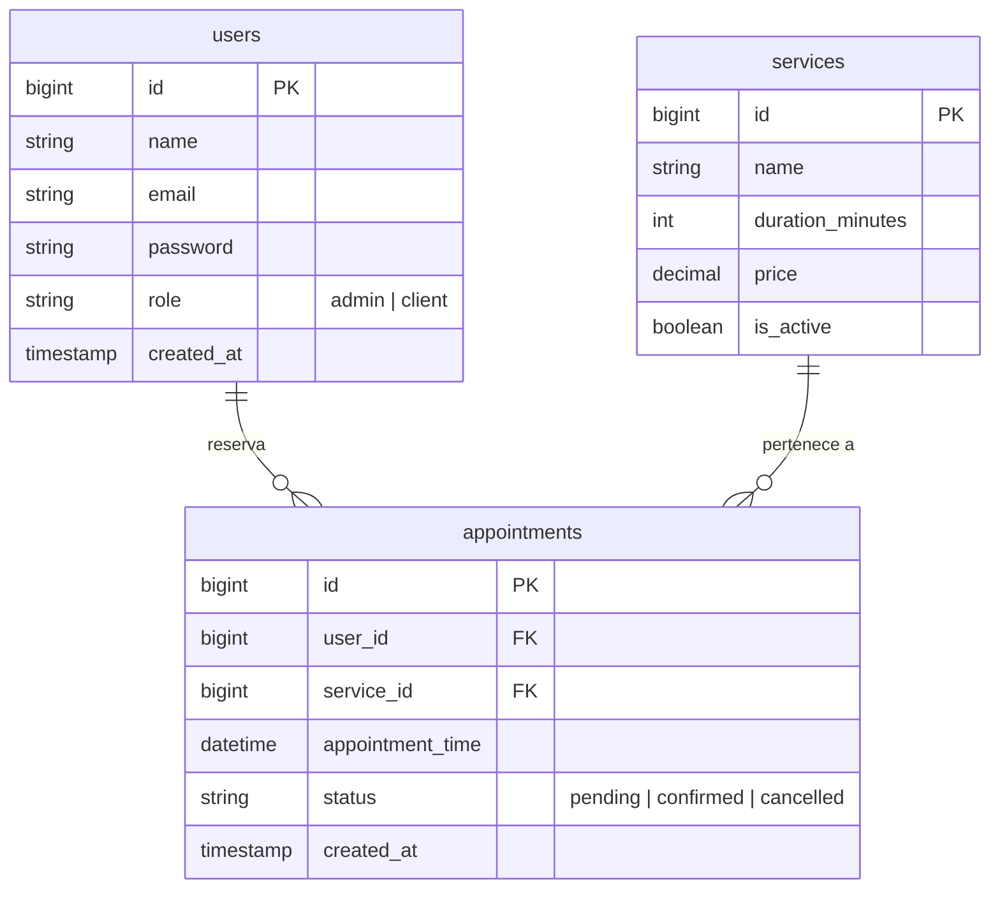
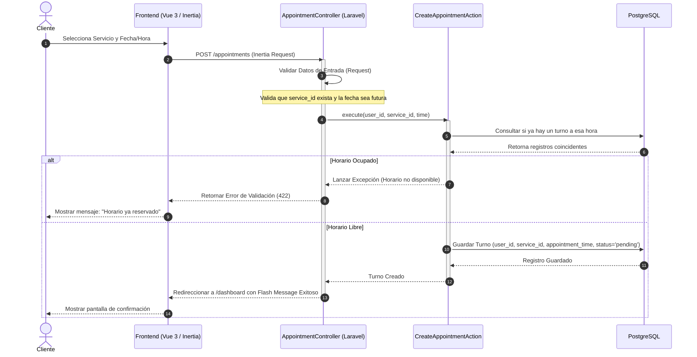
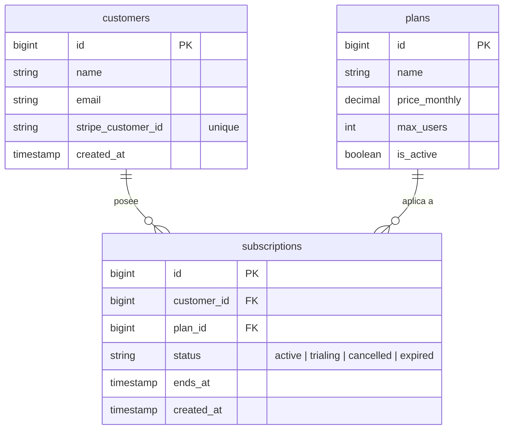
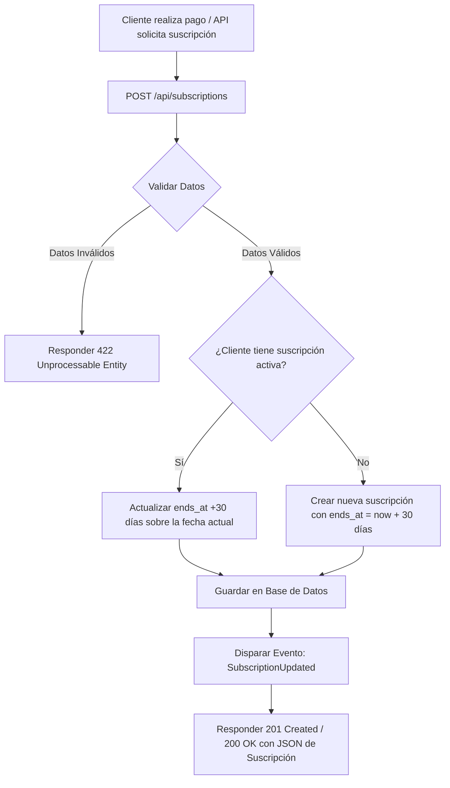

# Workflow y Plantilla de Documentación de Proyectos

Este documento sirve como la **plantilla oficial** y guía de estándares para la planificación, diseño y documentación de proyectos de software. Al final se incluyen dos ejemplos de referencia listos para usar: uno Fullstack (Laravel + Inertia + Vue) y otro Backend-Only (Laravel API).

---

## 📋 Estructura de la Plantilla (Copia este bloque para nuevos proyectos)

### 1. Brief del Proyecto
* **Problema:** ¿Qué dolor del mundo real resuelve este software?
* **Objetivo:** ¿Cómo lo resuelve y cuál es la propuesta de valor?
* **Público Objetivo:** ¿Quiénes son los usuarios finales? (ej. Cliente, Administrador, Vendedor).
* **Alcance del MVP (Mínimo Viable Producto):** Qué entra estrictamente en la primera versión y qué queda fuera para el futuro.

### 2. Stack Tecnológica y Arquitectura
* **Frontend:** Framework, herramientas de diseño, estado y comunicación.
* **Backend:** Lenguaje, framework y librerías clave.
* **Persistencia y Caché:** Base de datos relacional/no relacional, almacén en memoria para colas/sesiones.
* **Servicios de Terceros:** Pasarelas de pago, APIs de correo, IA, etc.

### 3. Modelo de Datos (ERD)
* *Inserta aquí el diagrama entidad-relación usando Mermaid.*
* **Diccionario de datos básico:** Descripción breve de tablas principales y sus campos críticos.

### 4. Flujos de Trabajo y Casos de Uso
* *Inserta diagramas de secuencia o de flujo usando Mermaid para modelar los procesos complejos o flujos de usuario principales.*

### 5. Estructura de Endpoints / Rutas y Páginas
* Lista de endpoints HTTP (método, ruta, función) y/o las páginas del frontend correspondientes.

### 6. Estructura de Directorios del Proyecto
* *Inserta el árbol de directorios simplificado del backend y frontend.*
* **Componentes clave:** Explicar brevemente dónde se ubican los controladores, modelos, servicios/acciones, vistas, etc.

### 7. Planificación de Tareas (Backlog)
* **Product Backlog:** Historias de Usuario con sus correspondientes Criterios de Aceptación.
* **Sprint Planning:** División de las Historias de Usuario en tareas técnicas atómicas y estimación de puntos de historia.

### 7. Estándares de Código y Git Flow
* **Ramas:** `main`, `develop`, `feature/*`, `hotfix/*`.
* **Commits:** Formato convencional (ej. `feat(auth): ...`, `fix(db): ...`).
* **Fase de Inicialización (Commits de Configuración):**
  * `chore: initial commit` (Esqueleto limpio inicial generado por el framework)
  * `chore(config): setup docker-compose and environment variables`
  * `chore(deps): install inertia, vue, and frontend dependencies`
  * `chore(lint): configure laravel pint, eslint, and phpstan`
  * `ci: configure github actions initial workflow`

---

# 📚 Ejemplos de Referencia

## ⚡ EJEMPLO 1: Proyecto Fullstack (Laravel + Inertia + Vue 3)
### *Sistema de Reserva de Turnos para Peluquería/Barbería*

### 1. Brief del Proyecto
* **Problema:** Los clientes pierden tiempo llamando para agendar turnos y los barberos tienen problemas de organización con agendas en papel.
* **Objetivo:** Una plataforma web autogestionada para agendar turnos de forma rápida y visual.
* **Público Objetivo:** Cliente (reserva turnos) y Administrador/Barbero (gestiona la agenda y servicios).
* **MVP:**
  * Registro e inicio de sesión de usuarios.
  * CRUD de Servicios (Administrador).
  * CRUD de Turnos con selección de servicio y horario libre (Cliente/Administrador).
  * Validación básica de colisiones de horarios.

### 2. Stack Tecnológica y Arquitectura
* **Frontend:** Vue 3 (Composition API) + Inertia.js (para eliminar la necesidad de crear una API REST dedicada) + TailwindCSS.
* **Backend:** Laravel 12 + PHP 8.4.
* **Persistencia:** PostgreSQL.
* **Calidad y Testing:** Pest + Laravel Pint.

### 3. Modelo de Datos (ERD)



### 4. Flujos de Trabajo (Proceso de Reserva)



### 5. Estructura de Rutas e Inertia Pages
* `GET /services` -> `Service/Index.vue` (Listar servicios)
* `POST /services` -> `ServiceController@store` (Crear servicio - Admin)
* `PUT /services/{service}` -> `ServiceController@update` (Editar servicio - Admin)
* `DELETE /services/{service}` -> `ServiceController@destroy` (Desactivar servicio - Admin)
* `GET /appointments/create` -> `Appointment/Create.vue` (Pantalla de reserva)
* `POST /appointments` -> `AppointmentController@store` (Crear turno - Cliente)
* `PUT /appointments/{appointment}/cancel` -> `AppointmentController@cancel` (Cancelar turno)

### 6. Estructura de Directorios del Proyecto
```text
app/
├── Actions/
│   └── CreateAppointmentAction.php (Lógica de validación y reserva)
├── Http/
│   ├── Controllers/
│   │   ├── AppointmentController.php
│   │   └── ServiceController.php
│   └── Requests/
│       ├── StoreAppointmentRequest.php
│       └── StoreServiceRequest.php
└── Models/
    ├── Appointment.php
    └── Service.php

resources/js/
├── Pages/
│   ├── Appointment/
│   │   └── Create.vue (Calendario y selección de horario)
│   └── Service/
│       └── Index.vue (Configuración de servicios del barbero)
└── Components/
    └── UI/
        └── Button.vue
```

### 7. Planificación de Tareas (Backlog)
* **Product Backlog:**
  * **US01 (Gestión de Servicios):** Como administrador, quiero crear, editar y desactivar servicios para definir la oferta del negocio.
    * *Criterios de Aceptación:*
      * El nombre del servicio debe ser único.
      * La desactivación no debe eliminar turnos existentes, solo impedir nuevas reservas.
  * **US02 (Reserva de Turnos):** Como cliente, quiero ver los horarios disponibles y reservar un turno para asegurar mi atención.
    * *Criterios de Aceptación:*
      * No se permiten reservas en fechas pasadas.
      * No se permiten reservas duplicadas sobre el mismo bloque horario (validación contra colisiones).
* **Sprint 1: MVP de Agenda de Turnos**
  * **Sprint Backlog:**
    * **US01 - CRUD de Servicios (3 SP):**
      * *Tarea 1.1 (Backend):* Crear migración, modelo, factory y request de validación para `Service`.
      * *Tarea 1.2 (Backend):* Implementar controlador REST de servicios y rutas asociadas.
      * *Tarea 1.3 (Frontend):* Diseñar vista con Inertia/Vue para listar y crear servicios.
    * **US02 - Reserva de Turnos (5 SP):**
      * *Tarea 2.1 (Backend):* Crear migración y modelo de `Appointment`.
      * *Tarea 2.2 (Backend):* Implementar acción `CreateAppointmentAction` con lógica de validación de colisiones.
      * *Tarea 2.3 (Frontend):* Diseñar pantalla de reservas (calendario simple + selección de servicio).

### 8. Estándares de Código y Git Flow
* **Branching:** `feature/services`, `feature/appointments`.
* **Commits:**
  * `feat(services): add CRUD database structure and API endpoints`
  * `feat(appointments): add calendar reservation page and creation logic`

---

## ⚙️ EJEMPLO 2: Proyecto Backend-Only (Laravel API)
### *API de Gestión de Suscripciones (SaaS Básico)*

### 1. Brief del Proyecto
* **Problema:** Los desarrolladores de SaaS necesitan una forma simple y aislada de trackear clientes, planes y el estado de sus suscripciones sin acoplar la lógica de pagos directamente al core del negocio.
* **Objetivo:** Un microservicio API que administre clientes, planes de pago y almacene la validez de sus accesos.
* **Público Objetivo:** Consumidores de API (otros microservicios o frontend SPA).
* **MVP:**
  * CRUD de Clientes.
  * CRUD de Planes.
  * Proceso de Activación/Renovación de Suscripción (Lógica de negocio para calcular expiración y cambiar estados).

### 2. Stack Tecnológica y Arquitectura
* **Backend:** Laravel 12 (API Mode) + PHP 8.4.
* **Persistencia:** PostgreSQL + Redis (para almacenamiento de caché de tokens API y colas de eventos).
* **Calidad y Testing:** Pest (Tests de integración HTTP) + PHPStan.

### 3. Modelo de Datos (ERD)



### 4. Flujos de Trabajo (Proceso de Suscripción)



### 5. Especificación de Endpoints (API)
* `GET /api/customers` -> `CustomerController@index` (Listar clientes)
* `POST /api/customers` -> `CustomerController@store` (Crear cliente)
* `GET /api/plans` -> `PlanController@index` (Listar planes activos)
* `POST /api/plans` -> `PlanController@store` (Crear plan)
* `POST /api/subscriptions` -> `SubscriptionController@store` (Activar/Renovar suscripción)
* `PUT /api/subscriptions/{subscription}/cancel` -> `SubscriptionController@cancel` (Marcar como cancelada para no renovar)

### 6. Estructura de Directorios del Proyecto
```text
app/
├── Actions/
│   └── ActivateSubscriptionAction.php (Cálculo de fechas y estado)
├── Events/
│   └── SubscriptionUpdated.php
├── Http/
│   ├── Controllers/
│   │   ├── CustomerController.php
│   │   ├── PlanController.php
│   │   └── SubscriptionController.php
│   └── Requests/
│       ├── StoreCustomerRequest.php
│       └── StoreSubscriptionRequest.php
└── Models/
    ├── Customer.php
    ├── Plan.php
    └── Subscription.php

tests/
└── Integration/
    └── SubscriptionTest.php (Pruebas Pest para la API)
```

### 7. Planificación de Tareas (Backlog)
* **Product Backlog:**
  * **US01 (Gestión de Clientes y Planes):** Como sistema consumidor, quiero registrar clientes y crear planes tarifarios para tener la base de la suscripción.
    * *Criterios de Aceptación:*
      * El cliente debe tener un email único y válido.
      * Los planes deben almacenar el límite máximo de usuarios (`max_users`).
  * **US02 (Proceso de Suscripción):** Como sistema de pagos, quiero activar o renovar la suscripción de un cliente para extender la vigencia del servicio.
    * *Criterios de Aceptación:*
      * El cálculo del vencimiento (`ends_at`) debe ser de 30 días a partir de la activación.
      * Debe disparar el evento asíncrono `SubscriptionUpdated`.
* **Sprint 1: Núcleo de Facturación y Planes**
  * **Sprint Backlog:**
    * **US01 - Clientes y Planes (5 SP):**
      * *Tarea 1.1 (Backend):* Crear migraciones, modelos y requests de validación para `Customer` y `Plan`.
      * *Tarea 1.2 (Backend):* Implementar controladores API para altas y listados de clientes y planes.
    * **US02 - Activación de Suscripción (5 SP):**
      * *Tarea 2.1 (Backend):* Crear modelo `Subscription` y su respectiva migración con llaves foráneas.
      * *Tarea 2.2 (Backend):* Crear endpoint `/api/subscriptions` y desarrollar la acción de renovación/activación.
      * *Tarea 2.3 (Backend):* Disparar evento `SubscriptionUpdated` y escribir tests de integración con Pest.

### 8. Estándares de Código y Git Flow
* **Branching:** `feature/customers-plans`, `feature/subscriptions-api`.
* **Commits:**
  * `feat(customers): add API endpoints and migrations for customers and plans`
  * `feat(subscriptions): implement billing activation logic and event emitter`